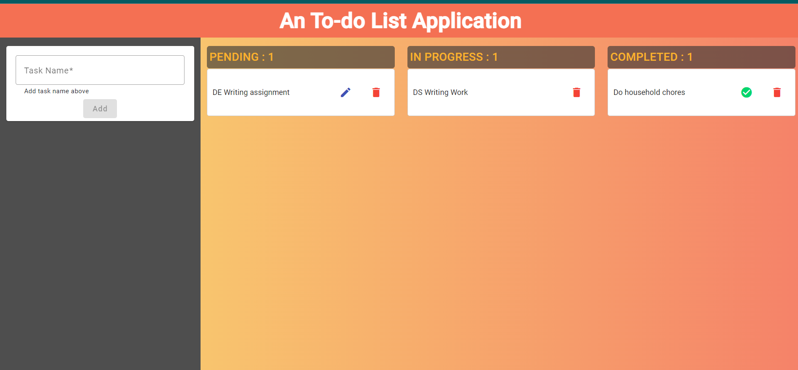

# To-do Application
This project focus on building a To-do Application in **Angular 16**, with the use of **Angular Material**, **Angular components** and **Bootstrap 5** such as drag-and-drop module, Toolbar, Card, Form Field and so on. The project was generated with [Angular CLI](https://github.com/angular/angular-cli) version 16.2.5.

This app offers **CUD operations** which allows user to create a list, update a list, delete a list, as well as displaying all the lists to efficienly manage their task lists. 

## Development server

Run `ng serve --port 4100` for a dev server. Navigate to `http://localhost:4100/`. The application will automatically reload if there is any change to the source files.

## Preview of the Application 

